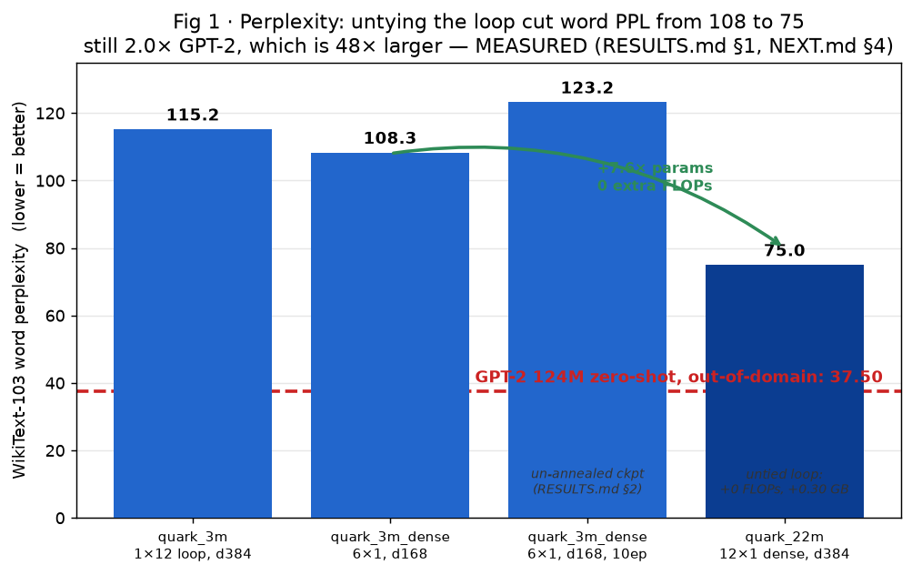
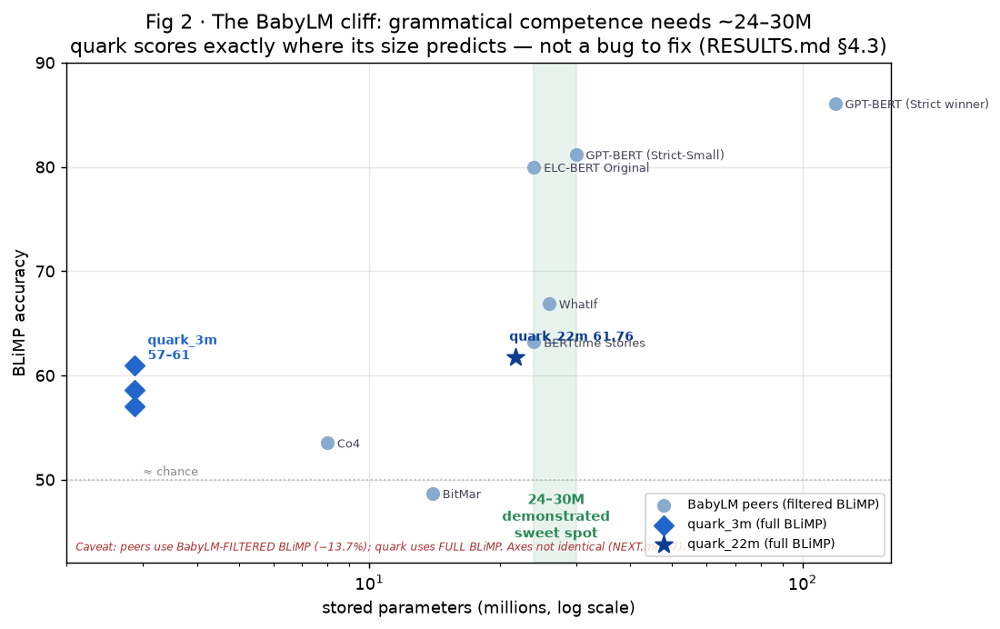
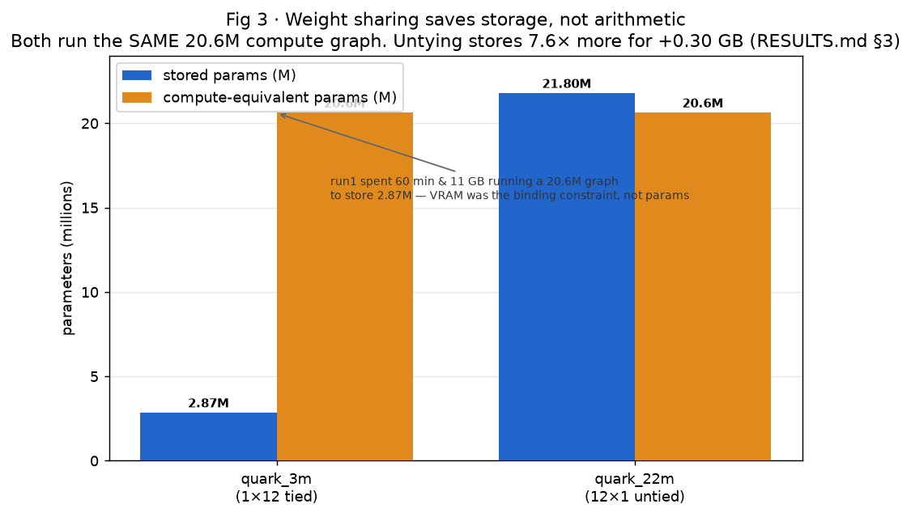
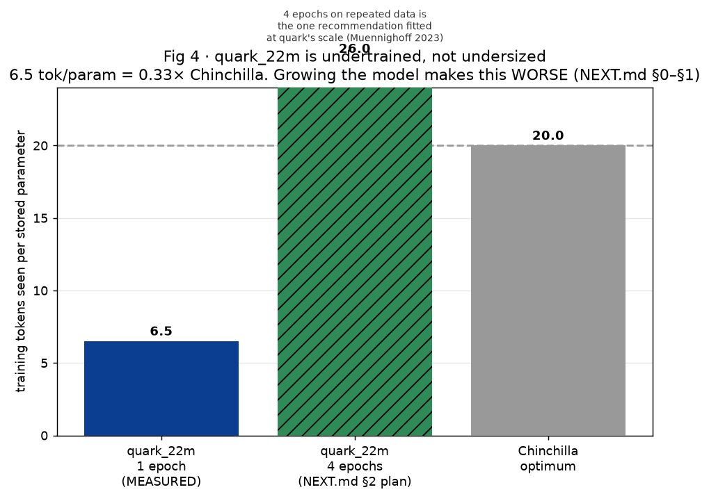
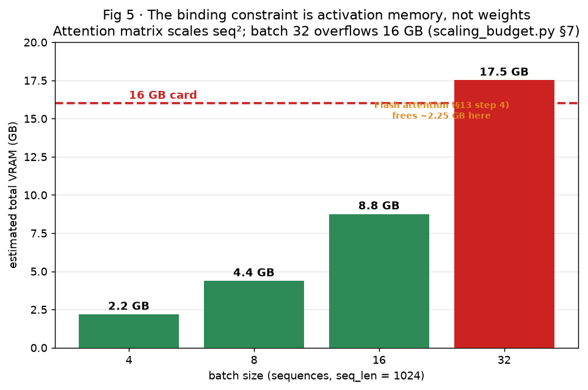
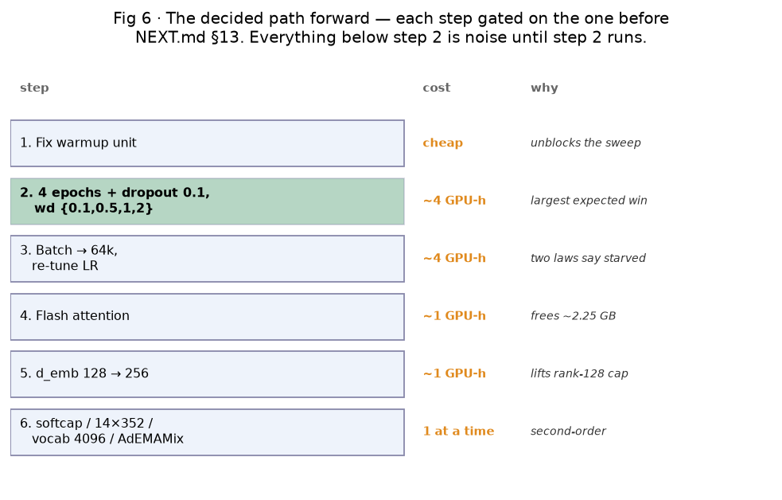
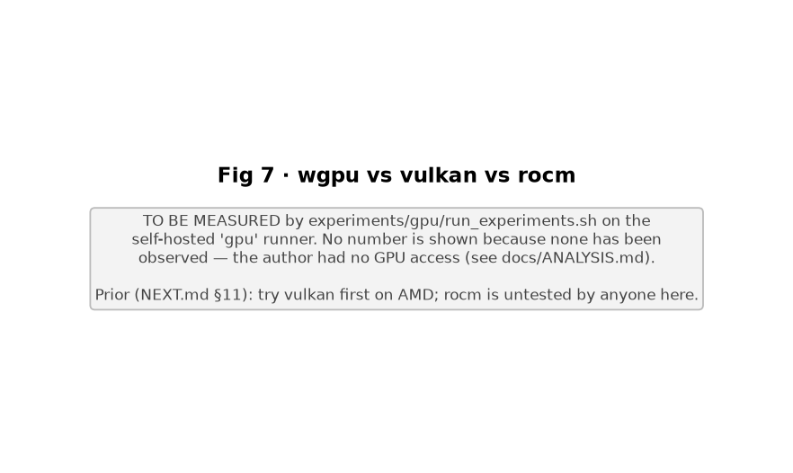
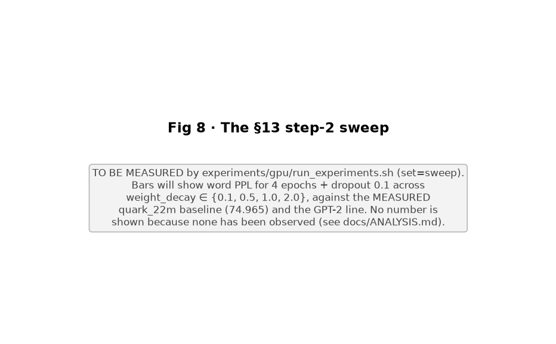

# quark — graphical report (issue #8)

> Generated by `experiments/report.py`. Every number is **MEASURED** (a training run or a cited source), **DERIVED** (computed from measured inputs), or **PROJECTED** (a scaling-law extrapolation, hatched and greyed). See the script header for the rule.

**Status of the GPU panels:** placeholders. The author could not reach the self-hosted `gpu` runner (fork PR, pull-only access) and this machine has no GPU, so no training was executed. `experiments/gpu/` is the ready-to-run harness that fills them — see docs/ANALYSIS.md.

## Untying the shared loop (quark_3m → quark_22m) cut word perplexity 108→75 at **zero extra FLOPs**. Still 2.0× GPT-2's zero-shot 37.50 — but GPT-2 is 48× larger and plays out-of-domain.

## **The decision chart.** Grammatical competence (BLiMP) has a cliff around 24–30M. quark scores exactly where its parameter count predicts; its BLiMP is the size class reporting in, not an anomaly to debug.

## The finding that reorganised the project: sharing saves **storage**, not **arithmetic**. VRAM — set by activations, i.e. compute — was always the binding constraint.

## quark_22m is **undertrained, not undersized**: 6.5 tokens/param, 0.33× Chinchilla. The largest expected win is more passes over the data, not more parameters.

## The real 16 GB wall is the seq² attention matrix. This is why flash attention (frees ~2.25 GB) funds the batch-size and epoch experiments.

## The path forward, in gated order. Step 2 (4 epochs + dropout + weight decay) is the headline; everything after it is second-order until it runs.

## wgpu / vulkan / rocm throughput — the one wholly GPU-dependent result.

## **The payoff test.** Word PPL for the NEXT.md §13 step-2 sweep against the MEASURED quark_22m baseline — the graphical answer to whether the recommended next runs actually help.

---

### The one-paragraph conclusion

The limiting factor is **not** the parameter count and **not** the architecture. It is the **token budget under a 16 GB VRAM ceiling**: quark_22m has seen a third of a Chinchilla-optimal number of tokens, and the ceiling is set by activation memory (which tracks compute), not by stored weights (which are abundant and cheap). The decided path (Fig 6) spends the next runs on **more tokens per parameter** (4 epochs + dropout + weight decay) and on **freeing VRAM to afford them** (flash attention, batch size), before touching anything exotic. The GPT-2 word-PPL race is kept only as a secondary metric — it is played on easy mode (in-domain vs zero-shot) and is the wrong headline (README, RESULTS.md §4.1).
